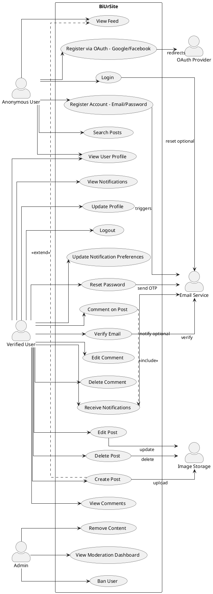

# BiUrSite – Use Case Model & Descriptions

**Document Version:** 1.0  
**Date:** February 22, 2026

---

## Table of Contents

1. [Use Case Diagram](#use-case-diagram)
2. [Use Case Descriptions](#use-case-descriptions)

---

## Use Case Diagram

**PlantUML Format:**



---

## Use Case Descriptions

### UC1 – Register Account (Email/Password)

**Use Case Name:** Register New Account Using Email and Password

**Primary Actor:** Anonymous User

**Secondary Actors:** Email Service (SMTP)

**Preconditions:**

- User is not yet registered in the system
- User has valid email address accessible to them
- User has stable internet connection

**Postconditions:**

- New user account created with status = "Unverified"
- Verification email sent to provided email address
- User can login but cannot post/comment until verified
- Email token generated with 24-hour expiry

**Main Flow:**

1. User navigates to registration page `/register`
2. User enters:
   - Email (must be unique)
   - Username (must be unique, 3-20 characters)
   - Password (min 8 characters)
   - Confirm password (must match)
3. System validates inputs:
   - Email format valid (RFC 5322)
   - Email unique (no existing account)
   - Username unique and alphanumeric
   - Passwords match and meet complexity
4. System creates User entity:
   - Hash password using bcrypt (cost factor 10)
   - Generate verification token (JWT with 24h expiry)
   - Set Role = "User", Status = "Unverified"
   - Store in MongoDB `users` collection
5. System sends verification email:
   - To: provided email address
   - Subject: "Verify Your BiUrSite Account"
   - Body: Link containing verification token
   - Include fallback manual entry option
6. System returns success response with user ID and message
7. User receives email, clicks verification link
8. (See UC3 – Verify Email for next steps)

**Alternate Flows:**

**AF1 – Email Already Exists:**

- Step 3 validation fails: email already registered
- System returns error: "Email already in use"
- User can click "Forgot Password" to recover account
- User can try registration with different email

**AF2 – Invalid Input:**

- Step 3 validation fails: invalid email, weak password, etc.
- System returns specific error per field
- User corrects input and resubmits form
- No data persisted

**AF3 – Email Service Unavailable:**

- Step 5 fails: SMTP server unreachable or returns error
- System rolls back user creation OR stores user as "pending-email"
- Offer "Resend verification email" button
- User can trigger retry, or staff can manually send email

**Exceptions:**

- Database error on write → System logs error, returns 500, prompts retry
- Network timeout during registration → User prompted to retry
- Duplicate key error (race condition) → Return email-exists error

**Business Rules:**

- Password must be hashed, never stored in plaintext
- Email uniqueness enforced at database index level
- Verification token single-use, non-reusable after consumed
- Account auto-deletes if unverified after 30 days (future implementation)

---

### UC2 – Register via OAuth (Google/Facebook)

**Use Case Name:** Register or Login Using OAuth Provider (Google/Facebook)

**Primary Actor:** Anonymous User

**Secondary Actors:** OAuth Provider (Google/Facebook), Email Service

**Preconditions:**

- User has active Google or Facebook account
- OAuth app credentials configured in system (client ID, secret)
- User internet connection available

**Postconditions:**

- New user created with status = "Active" (auto-verified)
- JWT token returned to client
- User immediately able to post/comment (no email verification needed)

**Main Flow:**

1. User clicks "Sign in with Google" or "Sign in with Facebook"
2. System redirects to OAuth provider consent screen
3. User grants permission (email, name, profile picture)
4. OAuth provider redirects back to app with authorization code
5. System validates:
   - Code is valid and not expired
   - State parameter matches (CSRF protection)
   - Redirect URI matches configured value
6. System exchanges code for access token & user profile:
   - Calls OAuth provider token endpoint
   - Extracts: email, name, profile picture URL
   - Validates email exists on provider
7. System checks if user already registered by email:
   - **If exists:** Retrieve user, update lastLogin timestamp
   - **If new:** Create user with:
     - Email from OAuth provider
     - Username generated from name or auto-generated (e.g., name + 4 digits)
     - AuthProvider = "Google" or "Facebook"
     - Status = "Active" (trust OAuth provider verification)
     - Password = null (OAuth user, no password hash)
     - Profile picture from OAuth provider
8. System generates JWT token with claims:
   - sub (subject): userId
   - email: user email
   - role: "User" or "Admin"
   - iat, exp: issued and expiry timestamps
9. System returns token & user profile to client
10. Client stores token in localStorage/sessionStorage
11. User redirected to dashboard, immediately able to interact

**Alternate Flows:**

**AF1 – OAuth Provider Denies Permission:**

- Step 3: User clicks "Deny" or closes consent screen
- OAuth provider redirects with error parameter
- System displays message: "Permission required to continue"
- User can retry or use email registration instead

**AF2 – Email Mismatch:**

- Step 7: Email from OAuth provider is already registered with different provider
- System checks `Email` field across `AuthProvider` values
- Options:
  - Auto-merge accounts (if same email)
  - Or prompt user: "Account already exists with this email"

**AF3 – State Parameter Mismatch:**

- Step 5: State doesn't match (CSRF attack attempt)
- System rejects request, returns 403 Forbidden
- Log security event, potential alerting

**Exceptions:**

- Network timeout calling OAuth provider → Retry logic, user prompted
- OAuth token expired → Invalid token, user re-authenticates
- Database error on user creation → Log error, return 500, user retries

**Business Rules:**

- OAuth tokens not stored in system (stateless)
- Email address is primary identifier across OAuth providers
- User profile picture: Update from OAuth provider on each login
- AuthProvider field prevents duplicate registrations across providers

---

### UC3 – Verify Email

**Use Case Name:** Verify Email Address After Registration

**Primary Actor:** Verified User (in-transition)

**Secondary Actors:** Email Service

**Preconditions:**

- User registered via UC1 (email/password) OR UC2 (OAuth to email)
- User received verification email with token
- Token is valid and not expired (24 hours)
- User's account status is "Unverified"

**Postconditions:**

- User status changed to "Active"
- Verification token consumed (cannot reuse)
- User now able to post, comment, receive notifications
- Optional: Welcome email sent

**Main Flow:**

1. User receives verification email
2. User clicks verification link containing token:
   - `{APP_URL}/auth/verify?token=<JWT_VERIFICATION_TOKEN>`
3. System extracts and validates token:
   - Token format valid (JWT)
   - Signature valid (signed with app secret)
   - Token not expired (iat + 24h > now)
   - Claim type = "email_verification"
4. System looks up user by token claim (`sub` = userId)
5. System checks user status = "Unverified"
6. System updates user:
   - Status = "Active"
   - Mark token as consumed (don't persist token itself, just status)
7. System returns success page with redirect to login or dashboard
8. User can now login and access features

**Alternate Flows:**

**AF1 – Token Expired:**

- Step 3 validation fails: token age > 24 hours
- System returns: "Verification link expired"
- Offer "Resend verification email" button
- User clicks, system generates new token & sends email
- User clicks new link, repeats main flow

**AF2 – Token Invalid or Malformed:**

- Step 3 validation fails: signature invalid, malformed JWT
- System returns: "Invalid or corrupted verification link"
- Offer user to request new verification email

**AF3 – User Not Found:**

- Step 4 fails: No user with given ID
- System returns: "Account not found"
- Likely attacker or old/deleted token

**AF4 – User Already Verified:**

- Step 5 check fails: User status already = "Active"
- System returns: "Account already verified"
- Redirect user to login

**Exceptions:**

- Database connection error → Log, prompt user to retry
- SMTP during resend → Retry queue, async notification

**Business Rules:**

- Verification token single-use; invalidate after first use
- Token expires after 24 hours (configurable)
- Email must be unique across all accounts
- Non-verified accounts may be garbage-collected after 30 days

---

### UC4 – Login

**Use Case Name:** Authenticate User and Obtain JWT Token

**Primary Actor:** Anonymous User (seeking authentication)

**Secondary Actors:** None

**Preconditions:**

- User has registered account (UC1 or UC2)
- User's account status is "Active" or "Verified"
- User account not banned or deleted
- User has stable internet connection

**Postconditions:**

- User authenticated and issued JWT token
- Token valid for 24 hours
- User access to protected endpoints
- Last login timestamp recorded

**Main Flow:**

1. User navigates to login page `/login`
2. User enters:
   - Email or username
   - Password
3. System validates inputs:
   - Email/username field not empty
   - Password field not empty
4. System queries user by email or username:
   - Lookup: `User.Email = input OR User.Username = input`
5. System checks user exists and status:
   - User found and status in ["Active", "Verified"]
   - If not found or status incorrect → AF1
6. System verifies password:
   - Compare input password against stored hash (bcrypt)
   - If not match → AF2
7. System generates JWT token:
   - Claims: `{sub: userId, email, username, role, iat, exp}`
   - Expiry: 24 hours
   - Signed with app secret key
8. System updates user lastLogin = now()
9. System returns token & user profile:
   - Token (for Authorization header)
   - User: { id, email, username, avatar, role }
10. Client stores token in secure storage
11. Client redirects to dashboard/feed

**Alternate Flows:**

**AF1 – User Not Found or Inactive:**

- Step 4 or 5 fails
- Possible reasons:
  - Email/username doesn't exist
  - Account status = "Banned" → message: "Your account has been banned"
  - Account status = "Deleted" → message: "Account not found"
  - Account status = "Unverified" → message: "Please verify your email first"
- System returns generic error: "Invalid email or password" (don't leak if user exists)
- Do NOT increment failed attempt counter for privacy reasons

**AF2 – Wrong Password:**

- Step 6 fails: Password hash doesn't match
- System returns: "Invalid email or password" (generic, don't leak email exists)
- Increment failed login counter for this user
- (Future Phase 2: Lock account after N failed attempts, require recovery)

**AF3 – Account Locked (Future):**

- User exceeded max failed login attempts
- Account temporarily locked (time-based or manual unlock)
- Return: "Account temporarily locked. Use forgot password or contact support."

**Exceptions:**

- Database connection error → Log error, return 500
- JWT generation failure → Log error, return 500, user retries
- Password hashing timeout (rare) → Handle gracefully, user retries

**Business Rules:**

- Use generic error message to prevent email enumeration attacks
- JWT tokens are stateless; no server-side session table
- HTTPS in production; tokens not sent in URLs
- SameSite=Strict cookie (if using cookies instead of localStorage)

---

### UC5 – Logout

**Use Case Name:** End User Session

**Primary Actor:** Verified User

**Secondary Actors:** None

**Preconditions:**

- User currently logged in (has valid JWT token)
- Session active

**Postconditions:**

- Token invalidated (client-side)
- User no longer able to access protected endpoints
- Redirect to public home page

**Main Flow:**

1. User clicks "Logout" button
2. Client removes token from storage (localStorage/sessionStorage)
3. Client clears any unsaved state/cache
4. Client redirects to home page or login page
5. User's session ended (from user perspective)

**Alternate Flows:**

**AF1 – Session Timeout:**

- User inactive for extended period (e.g., 24 hours)
- JWT token expires naturally
- Next API call with expired token returns 401 Unauthorized
- Client detects 401, clears token, redirects to login
- User prompted: "Session expired. Please login again."

**AF2 – Admin Revokes Session (Future):**

- Admin forcibly logs out a user
- (Requires token blacklist or server-side session table; deferred to Phase 2)

**Exceptions:**

- Network error during logout → Token removed locally anyway, user offline
- Browser storage clear failure → May leave orphaned token, but expires in 24h

**Business Rules:**

- No backend logout endpoint needed (stateless JWT)
- Token always expires after 24 hours regardless
- Logout is client-side only; token remains valid if stolen
- Future: Implement refresh tokens for longer-term sessions without storing plaintext token

---

### UC6 – Reset Password

**Use Case Name:** Recover Lost or Forgotten Password

**Primary Actor:** Anonymous User (who forgot password)

**Secondary Actors:** Email Service

**Preconditions:**

- User registered account (UC1 or UC2)
- User lost access to password
- User has access to registered email address

**Postconditions:**

- New password set securely
- OTP token consumed
- Email confirmation of password change sent
- User able to login with new password

**Main Flow:**

1. User navigates to "Forgot Password" page
2. User enters email address
3. System validates:
   - Email format valid
   - Email exists in user database
4. System generates OTP (One-Time Password):
   - 6-digit random code OR temporary URL token
   - Expiry: 30 minutes
   - Store in user record (e.g., `Otp` property)
5. System sends email with OTP:
   - Subject: "Password Reset Request for BiUrSite"
   - Body: OTP code (or reset link with token embedded)
   - Include note: "Ignore if you didn't request this"
6. System returns success: "Check your email for password reset instructions"
7. User receives email, enters OTP on reset form OR clicks link
8. System validates OTP:
   - OTP matches stored value
   - OTP not expired (30 min window)
   - OTP not yet used
9. User enters new password (with validation as per registration)
10. System validates password:
    - Min 8 characters
    - Different from previous password (if tracking history)
11. System updates user:
    - Hash new password
    - Clear OTP field (mark as used/consumed)
    - Update ModifiedDate
12. System sends confirmation email:
    - Subject: "Your BiUrSite Password Has Been Changed"
    - Body: Confirm change, security note
13. System returns success and redirects to login
14. User logs in with new password (UC4)

**Alternate Flows:**

**AF1 – Email Not Found:**

- Step 3: Email doesn't exist
- System returns (generic): "If account exists, you'll receive reset instructions"
- Don't leak whether email is registered (privacy)
- User may try alternative email if multi-account holder

**AF2 – OTP Expired:**

- Step 8: OTP age > 30 minutes
- System returns: "Reset link expired"
- Offer "Resend password reset email" button
- User repeats main flow from step 1

**AF3 – Wrong OTP:**

- Step 8: User-entered OTP doesn't match or invalid format
- System returns: "Invalid OTP"
- Allow user to request new OTP (regenerate, resend)

**AF4 – OTP Used Multiple Times (Brute Force):**

- Step 8: Multiple failed OTP attempts (e.g., > 3)
- System locks OTP temporarily (e.g., 15 minutes)
- Return: "Too many attempts. Try again later or request new reset."

**AF5 – Email Service Failure:**

- Step 5: SMTP fails to send
- System handles gracefully:
  - Retry queue (async)
  - Fallback option: Allow manual entry of OTP if possible
  - Log error for admin monitoring

**Exceptions:**

- Database update fails → Rollback OTP generation, return 500, user retries
- Multiple simultaneous resets → Later request overwrites previous OTP (acceptable)

**Business Rules:**

- OTP single-use; invalidated after successful password reset
- OTP expires in 30 minutes (not 24 hours, to reduce exposure window)
- Password hash updated, no plaintext stored
- Send confirmation email after successful reset (audit trail)

---

### UC7 – View Feed

**Use Case Name:** Browse Recent Posts (All Users)

**Primary Actor:** Anonymous User / Verified User

**Secondary Actors:** None

**Preconditions:**

- System has posts (posts collection populated)
- User has internet connection

**Postconditions:**

- Feed displayed with paginated posts
- Posts sorted by most recent first
- User can navigate to next/prev page

**Main Flow:**

1. User navigates to home or feed page `/` or `/feed`
2. System queries posts from MongoDB:
   - Filter: `Status = "Active"` (exclude deleted)
   - Sort: `CreatedDate DESC` (newest first)
   - Limit: 10 posts per page
   - Skip: `(pageNumber - 1) * pageSize`
   - Pagination: `pageNumber=1` in default request
3. System populates post details:
   - Post ID, text, image URL, createdAt
   - Author snapshot: ID, username, avatar
   - Recent comments: Last 3 comments with author info
   - Counts: commentsCount, createdAt
4. System returns paginated response:
   ```json
   {
     "data": [
       {
         "id": "uuid",
         "text": "My post content",
         "image": "https://...",
         "author": { "id": "...", "username": "alice", "avatar": "..." },
         "recentComments": [
           { "id": "...", "text": "Great!", "author": { "username": "bob" } }
         ],
         "commentsCount": 5,
         "createdAt": "2025-10-26T10:00:00Z"
       }
     ],
     "pageNumber": 1,
     "pageSize": 10,
     "totalPages": 8,
     "hasNextPage": true
   }
   ```
5. Client renders feed UI with post cards
6. User can click on post to view details (UC → ViewPostDetails)
7. User can click next/prev to paginate

**Alternate Flows:**

**AF1 – No Posts Available:**

- Step 2: Result set empty
- System returns empty list with message: "No posts yet. Be the first to share!"
- Show call-to-action: "Sign up to create a post"

**AF2 – Pagination Out of Bounds:**

- User requests `pageNumber > totalPages`
- System returns last valid page or empty list with helpful message

**AF3 – Performance: Database Slow (Future Optimization):**

- Could cache feed in Redis:
  - Cache key: `feed:page:1:cached`
  - TTL: 5 minutes
  - Invalidate on new post creation

**Exceptions:**

- Database connection error → Return 500, user retries
- GraphQL timeout (N+1 queries) → Optimize query, add indexes

**Business Rules:**

- Only "Active" posts shown; deleted posts hidden
- Posts with deleted author still visible (author snapshot is immutable)
- Anonymous users see same feed as verified users (no personalization yet)
- Pagination limit: max 100 posts per request (prevent abuse)

---

### UC8 – Search Posts

**Use Case Name:** Filter Posts by Keywords

**Primary Actor:** All Users

**Secondary Actors:** None

**Preconditions:**

- Posts exist in system
- User wants to find specific posts by topic

**Postconditions:**

- Filtered post list displayed (by keyword match)
- Results paginated

**Main Flow:**

1. User enters search keyword(s) in search box (top of page)
2. System triggers search query:
   - Input: `keywords = "advice"`
   - Filter: `Status = "Active" AND (Text CONTAINS keywords OR Title CONTAINS keywords)`
   - Sort: By relevance, then by createdDate DESC
3. System performs MongoDB text search:
   - Text index on `posts.Text` field
   - Regex or text search operator
4. System returns matching posts:
   - Same format as UC7 (feed)
   - Paginated with pageNumber=1
   - Total results count
5. Client displays results: "N results for 'advice'"
6. User can paginate or refine search

**Alternate Flows:**

**AF1 – No Results:**

- Step 4: No posts match filter
- System returns empty list: "No posts found matching 'advice'"
- Offer suggestion: "Try different keywords"

**AF2 – Empty Search:**

- User submits empty keyword
- System returns: "Please enter search term"
- Or default to showing all posts (full feed)

**AF3 – Case Insensitivity & Special Characters:**

- System normalizes input: lowercase, trim whitespace
- Remove SQL/NoSQL injection chars (server-side validation)

**Exceptions:**

- Text index not built → Fallback to regex search (slower)
- Database timeout on complex search → Return partial results or timeout error

**Business Rules:**

- Search is case-insensitive
- Partial word match supported (substring)
- Special characters: Escape or ignore (prevent injection)
- Performance: MongoDB text index recommended for production

---

### UC9 – Create Post

**Use Case Name:** Author Publishes New Post

**Primary Actor:** Verified User

**Secondary Actors:** Email Service (optional), Image Storage, Event Handlers

**Preconditions:**

- User logged in (valid JWT token)
- User status = "Active" (verified/non-banned)
- User has post content ready (text ± image)

**Postconditions:**

- Post created and visible in feed
- Author receives confirmation
- Notifications sent to followers (if feature exists)
- Post added to real-time feed via SignalR (future)

**Main Flow:**

1. User navigates to "Create Post" page or clicks "New Post" button
2. User enters:
   - Post text (required, min 3 chars, max 5000 chars)
   - Optional image file (JPG, PNG, WebP, max 10 MB)
3. User clicks "Publish"
4. System validates:
   - User authenticated (extract userId from JWT)
   - User status = "Active"
   - Post text not empty and within length constraints
   - Image (if provided): format valid, file size < 10 MB
5. System processes image (if provided):
   - Read file buffer
   - Compress/optimize (reduce to max 800x600px)
   - Upload to Cloudinary/S3
   - Get permanent URL
   - (Alternative: Store base64 inline in MongoDB if small)
6. System creates Post document:
   - New PostId (GUID)
   - UserId = logged-in user ID
   - Text = input text
   - Image URL (if provided)
   - Status = "Active"
   - CreatedDate = now()
7. System stores Post in MongoDB `posts` collection
8. System publishes `PostCreatedEvent` (MediatR):
   - Event contains: PostId, UserId, Text, ImageUrl
9. Event handlers triggered (async):
   - **UploadImageHandler:** Store image metadata (if not using CDN)
   - **SendPostToFeedHandler:** Broadcast to all subscribers (SignalR FeedHub)
10. System returns success with post DTO:
    ```json
    {
      "id": "uuid",
      "text": "...",
      "image": "https://...",
      "author": { "id": "...", "username": "alice", "avatar": "..." },
      "createdAt": "2025-10-26T11:00:00Z"
    }
    ```
11. Client displays success message: "Post published!"
12. Client refreshes feed or redirects to post details

**Alternate Flows:**

**AF1 – Validation Fails:**

- Step 4: Text too short, empty, or image invalid format
- System returns validation error(s) per field
- User corrects and resubmits
- No post created

**AF2 – Image Upload Fails:**

- Step 5: Cloudinary/S3 upload fails (network error, quota exceeded)
- System options:
  - Rollback entire post creation (require image)
  - Or: Create post without image, show error "Image upload failed"
- Return error, offer retry

**AF3 – Database Write Fails:**

- Step 7: MongoDB insert fails (disk full, connection lost)
- System rolls back any image uploads
- Return 500 error, user prompted to retry
- Log error for admin monitoring

**AF4 – User Loses Connection During Upload:**

- Step 5 or 7: Network timeout
- Client detects, prompts user to retry
- If image partially uploaded, cleanup required (future implementation)

**Exceptions:**

- Authentication failure → Return 401, redirect to login
- Authorization failure (user banned) → Return 403
- Concurrent post creation → Race condition OK, both stored

**Business Rules:**

- Only verified users can create posts (status = "Active")
- Post text is immutable after creation (edit UC10 modifies, tracks modification)
- Image is optional; text is required
- Author is immutable (cannot change post author)
- Posts visible immediately after creation (no moderation queue in Phase 1)
- Real-time broadcast: Connected users see new posts in feed instantly

---

### UC10 – Edit Post

**Use Case Name:** Author Modifies Existing Post

**Primary Actor:** Verified User (post author)

**Secondary Actors:** Image Storage

**Preconditions:**

- User logged in
- Post exists and belongs to user (or user is admin)
- Post status = "Active" (not deleted)
- Post not locked/readonly

**Postconditions:**

- Post text and/or image updated
- ModifiedDate timestamp recorded
- Edit history tracked (no view of history yet)

**Main Flow:**

1. User navigates to post details or clicks "Edit" button on post
2. System verifies ownership:
   - Post author ID = current user ID (or user is admin)
   - If not → Return 403 Forbidden
3. System displays edit form pre-filled with:
   - Current post text
   - Current image (if any)
4. User modifies:
   - Post text (optional change)
   - Replace image (optional)
   - Check "Remove image" to delete current image
5. User clicks "Save"
6. System validates:
   - New text within constraints (3-5000 chars) if changed
   - Image format/size if new image provided
7. System handles image updates:
   - **If new image:** Upload to storage, get new URL
   - **If removeImage flag:** Delete old image from storage
   - **If no change:** Keep existing image URL
8. System updates Post document:
   - Text = new text (if provided)
   - Image URL = new URL (if provided)
   - ModifiedDate = now()
9. System publishes `PostModifiedEvent` (for future use)
10. System returns updated post DTO
11. Client displays success: "Post updated"
12. Client refreshes post view or redirects to feed

**Alternate Flows:**

**AF1 – Ownership Verification Fails:**

- Step 2: User not author and not admin
- System returns 403: "You don't have permission to edit this post"

**AF2 – Post Deleted:**

- Step 2 check: Post status = "Deleted"
- System returns: "Post not found or deleted"

**AF3 – Concurrent Edit:**

- Two users edit simultaneously
- Last-write-wins (MongoDB update)
- Potential conflict; recommend adding optimistic locking (version field) in Phase 2

**AF4 – Image Removal:**

- Step 7: Request to remove existing image
- If removeImage=true: Delete old image URL, set Image = null
- Update post accordingly

**Exceptions:**

- Image upload fails → Return error, keep existing image
- Database update fails → Rollback, return 500
- Network timeout → User prompted to retry

**Business Rules:**

- Edit author: Only post author or admin
- Edit history: ModifiedDate recorded, but no version history in Phase 1
- Image replacement: Old image deleted when new image uploaded
- Soft delete: Edit a deleted post returns "not found"

---

### UC11 – Delete Post

**Use Case Name:** Author or Admin Removes a Post

**Primary Actor:** Verified User (post author) OR Admin

**Secondary Actors:** Image Storage, Event Handlers

**Preconditions:**

- User logged in and owns post (or is admin)
- Post exists
- Post status = "Active" or "Deleted" (can delete either)

**Postconditions:**

- Post soft-deleted (Status = "Deleted", DeletedDate set)
- Associated image deleted from storage
- Post removed from feed view
- Comments may be cascaded to deleted status (optional)

**Main Flow:**

1. User navigates to post details or post card
2. User clicks "Delete" button or menu option
3. System displays confirmation dialog: "Delete this post? This action cannot be undone."
4. User confirms deletion
5. System verifies ownership:
   - Post author = current user ID (or user is admin)
   - If not → Return 403
6. System updates Post document:
   - Status = "Deleted"
   - DeletedDate = now()
   - DO NOT remove document from DB (soft delete)
7. (Optional) System cascades delete to comments:
   - Mark associated comments as Status = "Deleted"
8. System publishes `PostDeletedEvent`
9. Event handlers triggered:
   - **DeleteImageHandler:** Remove image from Cloudinary/S3 (if exists)
10. System returns success: "Post deleted"
11. Client removes post from feed immediately (optimistic update)
12. Client notifies any real-time subscribers via SignalR

**Alternate Flows:**

**AF1 – Client Confirms Deletion (No Server Confirmation):**

- Step 3: Skip confirmation if user preference set
- Directly execute deletion

**AF2 – Image Deletion Fails:**

- Step 9: Cloudinary/S3 deletion fails
- Post already marked deleted in DB
- Log error, image orphaned but not visible (acceptable)
- Continue without rollback

**AF3 – Soft Delete Already Marked:**

- Step 6: Post already Status = "Deleted"
- Idempotent operation; return success anyway

**Exceptions:**

- Authorization failure → Return 403
- Database update fails → Return 500, user retries
- Image service timeout → Continue (best effort), log error

**Business Rules:**

- Soft delete: DON'T physically remove document
- Post deleted, comments may remain or be marked deleted (TBD in design)
- Image deleted from external storage
- View feed excludes deleted posts (filter in query)
- Admin can delete any post
- User can only delete own posts

---

### UC12 – Comment on Post

**Use Case Name:** User Adds Comment to a Post

**Primary Actor:** Verified User

**Secondary Actors:** Event Handlers, Notification Service, Email Service

**Preconditions:**

- User logged in (status = "Active")
- Post exists and status = "Active"
- User has comment content ready

**Postconditions:**

- Comment stored in `comments` collection
- Post's `recentComments` array updated (last 3)
- Post's `commentsCount` incremented
- Notification created for post author
- Email notification sent to post author (if preference enabled)
- Comment visible in feed and post details

**Main Flow:**

1. User opens post details view
2. User enters comment text in text area (min 1 char, max 2000 chars)
3. User clicks "Post Comment" button
4. System validates:
   - User authenticated
   - User status = "Active"
   - Post exists and status = "Active"
   - Comment text not empty and within constraints
5. System creates Comment document:
   - CommentId (GUID)
   - PostId = post ID
   - UserId = current user ID
   - Text = input text
   - Status = "Active"
   - CreatedDate = now()
6. System stores Comment in MongoDB `comments` collection
7. System atomically updates Post document:
   - `$inc: { commentsCount: 1 }` (increment counter)
   - `$push: { recentComments: { $each: [newComment], $slice: -3 } }` (keep last 3)
8. System publishes `CommentCreatedEvent`:
   - Event: { PostId, UserId (commenter), CommentText, PostAuthorId }
9. Event handlers triggered:
   - **SendNotificationPostOwnerHandler:**
     - Fetch post author user
     - Create Notification in `notifications` collection
     - Message: "CommenterName commented on your post"
     - Also store in user's embedded `Notifications` array
   - **NotificationNotifier:**
     - Emit real-time notification via SignalR NotificationHub
     - Send to post author's user ID
     - Message: "CommenterName commented: '[comment text]'"
   - **SendEmailNotificationHandler (future):**
     - Check post author's notification preferences
     - If enabled: Send email notification
10. System returns created comment DTO:
    ```json
    {
      "id": "uuid",
      "text": "Great post, thanks for sharing!",
      "author": { "id": "...", "username": "bob", "avatar": "..." },
      "createdAt": "2025-10-26T12:00:00Z"
    }
    ```
11. Client displays comment in real-time (optimistic update)
12. Post author receives notification (if online via SignalR)

**Alternate Flows:**

**AF1 – Validation Fails:**

- Step 4: Comment too short, too long, or post not found
- System returns validation error
- User corrects and resubmits

**AF2 – Post Deleted:**

- Step 4 check: Post status = "Deleted"
- System returns: "Cannot comment on deleted post"

**AF3 – Post Author is Comment Author:**

- Step 8: CommenterId = PostAuthorId
- System still creates notification (self-reply)
- Or: Check in handler, skip self-notification (design choice)

**AF4 – Real-Time Notification Fails:**

- Step 9: SignalR message fails (user offline, connection lost)
- Comment still created and stored
- Notification retrieved on next login (from DB)
- No error returned to user

**Exceptions:**

- Database write fails → Return 500
- Concurrent comments → Both stored, both increment counter
- Network timeout during submit → User retries

**Business Rules:**

- Only verified users can comment
- Comment author immutable (no change after creation)
- Comments stored separately from posts
- Post's `recentComments` limited to last 3 (for feed preview)
- Full comment list retrieved from `comments` collection (separate query)
- Post author always receives notification (even if self-reply)

---

### UC13 – Edit Comment

**Use Case Name:** Comment Author Modifies Comment Text

**Primary Actor:** Verified User (comment author)

**Secondary Actors:** None

**Preconditions:**

- User logged in
- Comment exists and belongs to user (or user is admin)
- Comment status = "Active"

**Postconditions:**

- Comment text updated
- ModifiedDate recorded

**Main Flow:**

1. User hovers over comment, clicks "Edit" button
2. System verifies ownership:
   - Comment author = current user (or user is admin)
   - If not → Return 403
3. System displays edit form with current comment text
4. User modifies text (max 2000 chars)
5. User clicks "Save" or "Update"
6. System validates new text (1-2000 chars)
7. System updates comment in MongoDB:
   - Text = new text
   - ModifiedDate = now()
8. System updates post's `recentComments` array if comment is in it:
   - Find and update comment entry in `recentComments` array
9. System returns updated comment DTO
10. Client displays updated comment with "Edited" label

**Alternate Flows:**

**AF1 – Ownership Verification Fails:**

- Step 2: User not author and not admin
- Return 403

**AF2 – Comment Deleted:**

- Step 2 check: Comment status = "Deleted"
- Return: "Comment not found"

**Exceptions:**

- Database update fails → Return 500
- Concurrent edits → Last-write-wins

**Business Rules:**

- Edit author: Comment author only or admin
- ModifiedDate tracked (no version history in Phase 1)
- Display "Edited" indicator to readers
- No edit history/rollback in Phase 1

---

### UC14 – Delete Comment

**Use Case Name:** Author, Post Owner, or Admin Removes Comment

**Primary Actor:** Verified User (comment author OR post owner OR admin)

**Secondary Actors:** None

**Preconditions:**

- User logged in
- Comment exists
- User has permission (author, post owner, or admin)

**Postconditions:**

- Comment soft-deleted
- Post's `recentComments` updated (comment removed)
- Post's `commentsCount` decremented

**Main Flow:**

1. User clicks "Delete" on comment
2. System displays confirmation: "Delete comment?"
3. User confirms
4. System verifies permission:
   - Comment author = current user OR
   - Post owner = current user OR
   - User role = admin
   - If none → Return 403
5. System updates comment:
   - Status = "Deleted"
   - DeletedDate = now()
6. System atomically updates post:
   - `$inc: { commentsCount: -1 }` (decrement)
   - `$pull: { recentComments: { _id: commentId } }` (remove from recent)
7. System returns success: "Comment deleted"
8. Client removes comment from view

**Alternate Flows:**

**AF1 – Permission Denied:**

- Step 4: User not author, post owner, or admin
- Return 403

**AF2 – Idempotency:**

- Step 5: Comment already deleted (status = "Deleted")
- Return success anyway (idempotent operation)

**Exceptions:**

- Database update fails → Return 500

**Business Rules:**

- Soft delete: Status = "Deleted", not physically removed
- Permission: Author, post owner, or admin
- Cascading: Decrement post's commentsCount
- View filtering: Exclude deleted comments from feed/detail views

---

### UC15 – View Comments

**Use Case Name:** View All Comments on a Post (Paginated)

**Primary Actor:** All Users

**Secondary Actors:** None

**Preconditions:**

- Post exists and status = "Active"

**Postconditions:**

- Comment list displayed, paginated and sorted

**Main Flow:**

1. User navigates to post details page
2. System queries comments for post:
   - Filter: `PostId = <ID> AND Status = "Active"`
   - Sort: `CreatedDate DESC` (newest first)
   - Limit: 20 comments per page
   - Skip: `(pageNumber - 1) * pageSize`
3. System populates author info for each comment:
   - UserId, username, avatar
4. System returns comment list DTO:
   ```json
   {
     "comments": [
       {
         "id": "uuid",
         "text": "Great post!",
         "author": { "id": "...", "username": "alice", "avatar": "..." },
         "createdAt": "2025-10-26T12:00:00Z",
         "modifiedAt": null
       }
     ],
     "pageNumber": 1,
     "pageSize": 20,
     "totalComments": 42,
     "hasNextPage": true
   }
   ```
5. Client displays comments with pagination controls
6. User can navigate between pages

**Alternate Flows:**

**AF1 – No Comments:**

- Step 2: Result empty
- System returns empty list: "No comments yet. Be first to comment!"

**AF2 – Pagination Out of Bounds:**

- User requests pageNumber > totalPages
- System returns last valid page or empty list

**Exceptions:**

- Database timeout → Return error, user retries

**Business Rules:**

- Only "Active" comments shown (deleted excluded)
- Display ModifiedDate if comment was edited
- Show "Edited" indicator for modified comments
- Pagination: 20 comments per page

---

### UC16 – Receive Notifications

**Use Case Name:** User Receives Real-Time Notifications

**Primary Actor:** Verified User

**Secondary Actors:** Event Handlers, SignalR Hub

**Preconditions:**

- User logged in and authenticated (valid JWT)
- User connected to NotificationHub (WebSocket)
- Another user commented on user's post OR other trigger event

**Postconditions:**

- User receives real-time push notification
- Notification displayed in UI (toast, banner, sound)
- Notification also stored in DB for offline access

**Main Flow:**

1. Verified user opens application, logs in (UC4)
2. Client establishes SignalR connection to NotificationHub:

   ```javascript
   const connection = new HubConnectionBuilder()
     .withUrl("/notificationHub?access_token=" + token)
     .withAutomaticReconnect()
     .build();

   connection.on("ReceiveCommentNotification", (message) => {
     // Display notification UI
   });

   await connection.start();
   ```

3. User remains logged in and connected (socket open)
4. **Trigger:** Another user comments on user's post (UC12)
5. **Backend:** CommentCreatedEvent fired
6. **Backend:** SendNotificationPostOwnerHandler executes:
   - Fetch post author user
   - Create Notification document in DB
   - Publish notification via NotificationHub
7. **Backend:** NotificationNotifier emits SignalR message:
   ```csharp
   await Clients.User(postAuthorId).SendAsync(
     "ReceiveCommentNotification",
     new { message = "Alice commented on your post", commentId = "...", postId = "..." }
   );
   ```
8. **Client:** Event handler triggered on all connected devices:
   - Receives notification object
   - Display in UI (toast notification, sound, badge count)
   - Optionally: Store locally for later retrieval
9. User sees notification: "Alice commented: 'Great post!'"
10. User can click notification to navigate to post details

**Alternate Flows:**

**AF1 – User Offline:**

- Step 2: User is not connected to NotificationHub (closed app)
- Backend still creates Notification document in DB
- Notification persists
- On next login (user opens app), notification retrieved from DB (UC17)
- Shown as "You have N new notifications"

**AF2 – Multiple Concurrent Connections:**

- User logged in on 2 devices (web + mobile)
- System sends notification to both via `Clients.User(userId)`
- SignalR infrastructure handles routing to multiple connections
- User receives notification on all connected devices

**AF3 – Notification Preferences Disabled:**

- Post author has disabled notifications in settings
- Backend checks preference before creating/sending
- Comment still created, but no notification sent
- Notification document may not be created (design choice)

**AF4 – SignalR Connection Lost:**

- Mid-session, user's network drops
- Connection closed, client offline
- HubConnectionBuilder configured with `withAutomaticReconnect()`
- Attempts to reconnect
- Meanwhile, new notifications stored in DB
- On reconnection, retrieve unread notifications (UC17)

**Exceptions:**

- SignalR server down → Connection fails, user prompted to retry
- Database write fails (notification creation) → Log error, notification lost (acceptable)
- Network timeout → Handled by client retry logic

**Business Rules:**

- Notifications sent only to notification recipient (post author)
- Each comment creates one notification
- Real-time delivery if user online, DB fallback if offline
- Notification preferences respected (if implemented)

---

### UC17 – View Notifications

**Use Case Name:** User Reviews Notification History

**Primary Actor:** Verified User

**Secondary Actors:** None

**Preconditions:**

- User logged in
- User has notifications in system
- User navigates to notifications page or opens notification drawer

**Postconditions:**

- Notification list displayed (paginated)
- User can clear individual notifications

**Main Flow:**

1. User clicks notification icon or navigates to `/notifications`
2. System queries notifications for user:
   - Filter: `UserId = <ID> AND Status = "Active"`
   - Sort: `CreatedDate DESC` (newest first)
   - Limit: 10 per page
3. System returns notification list:
   ```json
   {
     "notifications": [
       {
         "id": "uuid",
         "message": "Alice commented on your post",
         "postId": "post-uuid",
         "post": { "id": "...", "text": "My first post...", "author": "..." },
         "commenter": { "id": "...", "username": "alice", "avatar": "..." },
         "createdAt": "2025-10-26T12:00:00Z",
         "read": false
       }
     ],
     "pageNumber": 1,
     "totalNotifications": 5,
     "unreadCount": 2
   }
   ```
4. Client displays notifications with metadata
5. User can:
   - Click notification to navigate to post
   - Click "Clear" to delete individual notification
   - Click "Clear All" to delete all notifications

**Alternate Flows:**

**AF1 – No Notifications:**

- Step 2: User has no notifications
- Display: "No notifications yet"

**AF2 – Unread Indicator:**

- Track "read" status per notification (future)
- Mark as read when user clicks on notification
- Display badge count of unread

**Exceptions:**

- Database timeout → Return error message

**Business Rules:**

- Display post details: ID, text preview, author
- Display commenter details: username, avatar
- Paginate: 10 per page
- Only show "Active" notifications (exclude deleted)

---

### UC18 – Update Profile

**Use Case Name:** User Modifies Their Profile Information

**Primary Actor:** Verified User

**Secondary Actors:** Image Storage

**Preconditions:**

- User logged in and authenticated
- User navigates to profile settings page

**Postconditions:**

- User profile updated with new info
- Avatar/profile picture updated
- Changes reflected in user's posts and comments

**Main Flow:**

1. User navigates to account settings or profile edit page
2. System displays current profile info:
   - Username (read-only, not editable)
   - Email (read-only, not editable; change via separate flow)
   - Bio (editable, max 500 chars)
   - Avatar/profile picture (current image + upload option)
   - Phone (optional, editable, optional)
3. User modifies fields:
   - Bio: New biographical text
   - Avatar: Select new image file (JPG/PNG, max 5 MB)
   - Phone: New phone number
4. User clicks "Save" or "Update Profile"
5. System validates:
   - Bio: Not more than 500 characters
   - Avatar: Format valid, size < 5 MB
   - Phone: Format valid (international format) or empty
6. System processes avatar (if provided):
   - Compress/optimize image
   - Upload to Cloudinary/S3
   - Get permanent URL
7. System updates user document in MongoDB:
   - Bio = new bio
   - Profile.AvatarUrl = new avatar URL (or keep old if not changing)
   - Phone = new phone (or null)
   - ModifiedDate = now()
8. System publishes `UpdatedProfileEvent`:
   - Event: { UserId, NewUsername, NewBio, NewAvatarUrl }
9. Event handlers triggered:
   - **UpdatedProfileDomainEventHandler:**
     - Update author snapshot in recent posts
     - Update recent comments with new avatar
     - Update notification messages with new display name
10. System returns updated user profile
11. Client displays success: "Profile updated"

**Alternate Flows:**

**AF1 – Image Upload Fails:**

- Step 6: Cloud storage fails
- Return error, user can retry
- Keep old avatar

**AF2 – No Changes:**

- User clicks "Save" without modifying any fields
- System detects no changes, returns success anyway
- No DB update needed

**AF3 – Username Change (Future):**

- Currently not allowed (read-only)
- Future: Allow with proper validation and propagation

**Exceptions:**

- Database update fails → Return 500
- Image processing timeout → Fallback to old image

**Business Rules:**

- Username immutable (no change in Phase 1)
- Email immutable (change requires separate verification flow)
- Avatar updates propagated to posts/comments (via event handler)
- Bio is optional

---

### UC19 – Update Notification Preferences

**Use Case Name:** User Configures Notification Settings

**Primary Actor:** Verified User

**Secondary Actors:** None

**Preconditions:**

- User logged in
- User navigates to notification preferences/settings

**Postconditions:**

- User notification preferences updated
- System respects new preferences for future notifications

**Main Flow:**

1. User navigates to settings → Notifications
2. System displays notification preference options:
   - **Email Notifications:**
     - [ ] Enabled (receive email when someone comments)
     - [ ] Disabled
   - **Real-Time Notifications:**
     - [ ] All notifications
     - [ ] Comments only
     - [ ] None
   - **Notification Frequency:**
     - [ ] Instant (real-time)
     - [ ] Daily digest (future)
     - [ ] Never
3. User selects preferences
4. User clicks "Save Preferences"
5. System validates preferences (ensure at least one option selected)
6. System updates user document:
   - profileNotificationStatus = new preference object
   - ModifiedDate = now()
7. System returns success: "Preferences saved"
8. Future notifications respect new settings

**Alternate Flows:**

**AF1 – All Notifications Disabled:**

- User unchecks all options
- System allows this (user wants no notifications)
- System doesn't send notifications or emails going forward

**AF2 – No Changes:**

- User clicks "Save" without changing any setting
- System detects no changes, returns success

**Exceptions:**

- Database update fails → Return 500

**Business Rules:**

- Default: Notifications enabled (on first login)
- Preferences stored per user
- Preferences checked before sending notification (in handlers)
- Separate control for email vs. real-time notifications

---

### UC20 – View User Profile

**Use Case Name:** Display Public User Profile

**Primary Actor:** All Users

**Secondary Actors:** None

**Preconditions:**

- User (target) exists and status ≠ "Deleted"
- Viewer navigates to user's profile page or clicks user profile link

**Postconditions:**

- User profile page displayed with public info
- User's recent posts listed

**Main Flow:**

1. User (viewer) clicks on another user's profile link or navigates to `/user/<userId>`
2. System queries user by ID:
   - Lookup: `User.Id = <ID>`
3. System validates user status:
   - Status ≠ "Deleted"
   - If deleted, return 404: "User not found"
4. System retrieves user profile data:
   - Username, bio, avatar
   - Account creation date
   - Post count
5. System retrieves user's recent posts:
   - Query: `posts where UserId = <ID> and Status = "Active"`
   - Limit: 10 posts
   - Sort: CreatedDate DESC
6. System returns profile DTO:
   ```json
   {
     "id": "uuid",
     "username": "alice",
     "bio": "I love sharing advice",
     "avatar": "https://...",
     "createdAt": "2025-10-01T...",
     "postCount": 42,
     "recentPosts": [ ... ]
   }
   ```
7. Client displays profile page with:
   - Avatar, username, bio
   - Account age (e.g., "Member since Oct 2025")
   - List of recent posts with links

**Alternate Flows:**

**AF1 – User Not Found:**

- Step 2: No user with given ID
- Return 404: "User not found"

**AF2 – User Deleted:**

- Step 3: User status = "Deleted"
- Return 404 (treat as non-existent)

**AF3 – Banned User:**

- User status = "Banned"
- Return profile but indicate: "This account is suspended"
- Don't display posts

**Exceptions:**

- Database timeout → Return error

**Business Rules:**

- Display only public profile info (no email, phone unless self)
- Show only author's non-deleted posts
- Account age visible (creation date)
- If viewing own profile, show additional options (edit, settings)

---

### UC21 – Ban User (Admin)

**Use Case Name:** Administrator Bans User from Platform

**Primary Actor:** Admin

**Secondary Actors:** Email Service

**Preconditions:**

- User logged in as admin
- Target user exists
- Admin has evidence of policy violation (planned Phase 2)

**Postconditions:**

- User status changed to "Banned"
- User cannot login, post, or comment
- Ban notification sent to user
- Ban logged for audit trail

**Main Flow:**

1. Admin navigates to admin dashboard / moderation
2. Admin searches for user to ban
3. Admin selects user and clicks "Ban User"
4. System displays ban dialog with fields:
   - Reason (dropdown + text): Harassment, spam, misinformation, etc.
   - Duration: Temporary (days) or permanent
   - Notify user (checkbox)
5. Admin fills in details and clicks "Confirm Ban"
6. System updates user document:
   - Status = "Banned"
   - BannedDate = now()
   - BanReason = admin reason
   - BanDuration = duration (null if permanent)
7. System optionally soft-deletes user's posts/comments:
   - Set Status = "Deleted" on all user's posts and comments
8. System publishes `UserBannedEvent`
9. Event handlers:
   - **SendBanNotificationHandler:**
     - Send email to user: "Your account has been banned"
     - Include reason and appeal instructions
10. System logs admin action:
    - Log: "Admin <AdminId> banned <UserId> for reason: <Reason>"
11. Admin dashboard updated, shows ban confirmation
12. User cannot login or interact (status check on login)

**Alternate Flows:**

**AF1 – User Already Banned:**

- Step 2: User status already = "Banned"
- Return: "User already banned"

**AF2 – Ban User Themselves (Future):**

- Admin bans self
- System prevents this (authorization check)

**AF3 – Temporary Ban Expiry:**

- Ban duration expires (e.g., 7 days)
- Scheduled job checks and un-bans user (status = "Active")
- User can login again (future implementation)

**Exceptions:**

- Database update fails → Return 500
- Email delivery fails → Continue, log error

**Business Rules:**

- Ban is soft (user record retained, not deleted)
- Ban prevents login, post creation, commenting
- Ban logged for audit trail and appeals process
- Admin action verified and logged
- Future: Appeal process for banned users

---

### UC22 – Remove Content (Admin)

**Use Case Name:** Administrator Deletes Post or Comment

**Primary Actor:** Admin

**Secondary Actors:** Email Service, Image Storage

**Preconditions:**

- User logged in as admin
- Post or comment exists
- Content violates platform policy

**Postconditions:**

- Content soft-deleted
- Author notified (optional)
- Action logged for audit trail

**Main Flow:**

1. Admin navigates to moderation dashboard or views content
2. Admin identifies violating post or comment
3. Admin clicks "Remove" or "Delete" option
4. System displays removal dialog:
   - Reason dropdown: Harassment, spam, explicit content, etc.
   - Optional note
   - Notify author checkbox
5. Admin confirms removal
6. System updates content (post or comment):
   - Status = "Deleted"
   - DeletedDate = now()
   - If comment: also decrement post's commentsCount
7. (Optional) Remove associated images from storage
8. System publishes `ContentRemovedEvent`
9. Event handlers:
   - **NotifyContentRemovalHandler (optional):**
     - Send email to content author explaining removal
     - Include reason and appeal process
10. System logs admin action:
    - Log: "Admin <AdminId> removed <ContentType> <ContentId> for reason: <Reason>"
11. Content immediately hidden from all users

**Alternate Flows:**

**AF1 – Content Already Deleted:**

- Step 6: Content already Status = "Deleted"
- Return: "Content already removed or not found"

**AF2 – No Notification to Author:**

- Admin unchecks "Notify author"
- No email sent

**Exceptions:**

- Database update fails → Return 500
- Image deletion fails → Content deleted from DB but image orphaned

**Business Rules:**

- Soft delete (don't physically remove)
- Action logged with reason
- Author optionally notified
- Content hidden from all views

---

### UC23 – View Moderation Dashboard (Admin)

**Use Case Name:** Administrator Views Platform Statistics & Reports

**Primary Actor:** Admin

**Secondary Actors:** None

**Preconditions:**

- User logged in as admin
- Admin navigates to admin dashboard (`/admin` or `/dashboard`)

**Postconditions:**

- Dashboard displayed with platform statistics
- Admin can access moderation tools

**Main Flow:**

1. Admin navigates to `/admin`
2. System verifies admin role (Role = "Admin")
3. System retrieves dashboard data:
   - Total users: Count of users with Status ≠ "Deleted"
   - Active users (last 7 days): Count of users with lastLogin > now - 7 days
   - Total posts: Count of posts with Status = "Active"
   - Total comments: Count of comments with Status = "Active"
   - Banned users: Count of users with Status = "Banned"
   - Reported content: Count of reports (if implemented)
4. System returns dashboard DTO:
   ```json
   {
     "totalUsers": 1234,
     "activeUsers7d": 456,
     "totalPosts": 5678,
     "totalComments": 12345,
     "bannedUsers": 12,
     "reportedContent": 5
   }
   ```
5. Client displays dashboard with:
   - Key metrics in card layout
   - Charts/graphs (optional, Phase 2)
   - Links to moderation tools: ban user, remove content, view reports
6. Admin can click on metric to see detailed list (e.g., click "Banned Users" to see list)

**Alternate Flows:**

**AF1 – Non-Admin Access:**

- Step 2: User role ≠ "Admin"
- Return 403: "Access denied"

**AF2 – No Data:**

- Metrics return 0 (e.g., no reports)
- Display "0" or "None" appropriately

**Exceptions:**

- Database timeout → Return error, admin retries

**Business Rules:**

- Admin-only access (enforce via role check)
- Metrics refreshed on dashboard load (not real-time cache)
- Display read-only; actual moderation via separate UCs (UC21, UC22)

---

**End of Use Case Descriptions**
