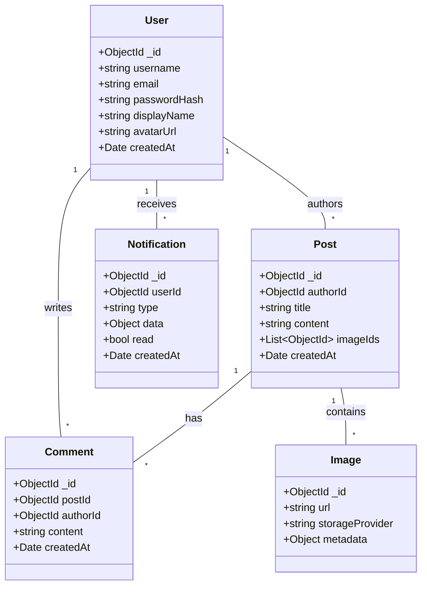
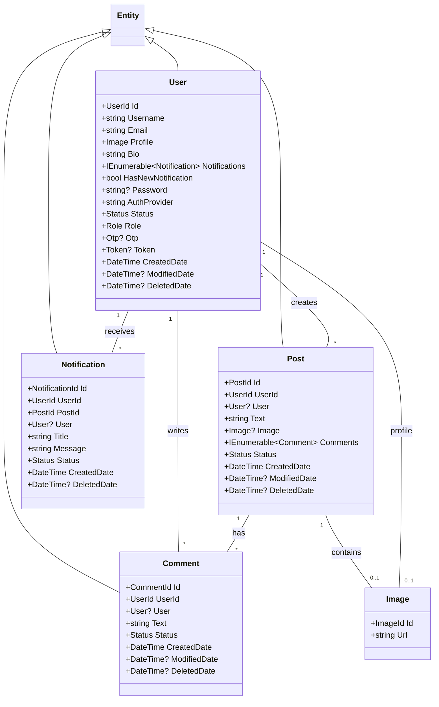
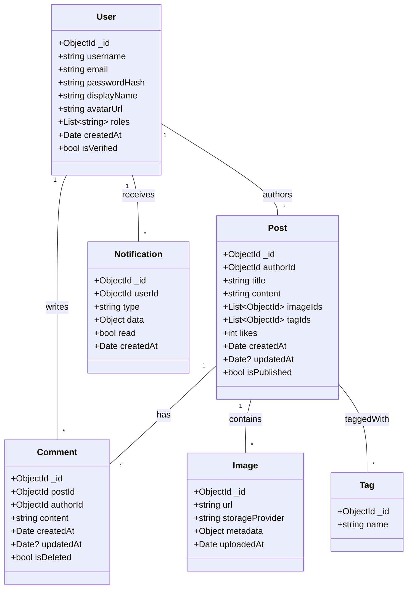
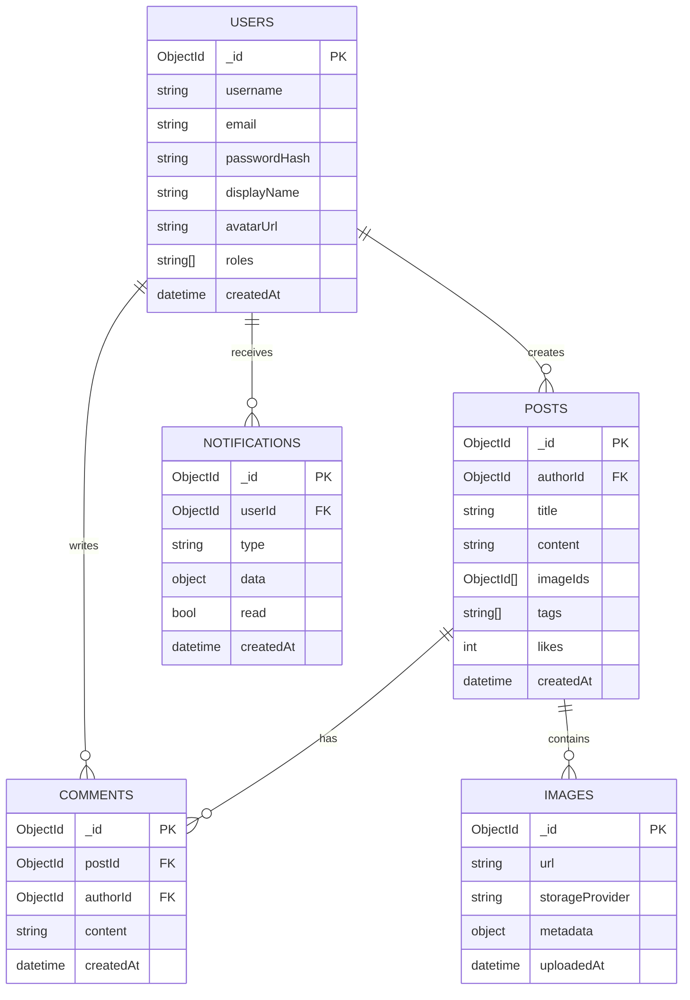

## BiUrSite — Architecture Overview

This document is a presentation-style architecture overview for the BiUrSite project. It covers the stack, component responsibilities, deployment recommendations, class diagram (Mermaid), and MongoDB schema examples.

---

## Goals

- Present a clear architecture for running the backend (ASP.NET Core) with MongoDB and Redis, and the frontend (Angular).
- Include SignalR usage for realtime notifications.
- Provide an actionable deployment and workflow guide (Git, DockerHub, Render, Netlify).
- Show class diagram and MongoDB schema to guide development and DB design.

---

## High-level components

- Frontend: Angular
- Backend API: .NET (ASP.NET Core) — REST + SignalR Hub
- Database: MongoDB (document DB; collections for users, posts, comments, notifications, images)
- Cache / Session / Rate limiting: Redis
- Realtime: SignalR (hosted in backend, clients connect from Angular)
- CI/CD & Code: Git (GitHub/GitLab), GitHub Actions for CI
- Container Registry: Docker Hub (build and push images)
- Hosting: Backend on Render (free web service tier) ; Frontend on Netlify (free static hosting)
- Image storage: Git LFS for small projects or dedicated image CDN/storage like Cloudinary (free tier) or S3/Spaces for production

---

## Component interaction (flow)

graph TD
A[Angular UI] -->|REST / WS| B[ASP.NET Core API]
B -->|reads/writes| C[(MongoDB)]
B -->|cache| D[(Redis)]
B -->|push| E[SignalR Hub]
E -->|push| A
B -->|stores images| F[Image Storage (Cloudinary / S3 / Git LFS)]
subgraph DevOps
G[GitHub] --> H[Docker Hub]
H --> I[Render (backend)]
G --> J[Netlify (frontend)]
end

---

## .NET (Backend) — responsibilities & notes

- Project: ASP.NET Core Web API
- Responsibilities:
  - Authentication (JWT / OAuth)
  - Business logic (MediatR in Application layer)
  - Validation & global error handling
  - SignalR Hub for realtime notifications and presence
  - Integration with MongoDB via typed repositories/UnitOfWork
  - Use Redis for caching frequently-read objects, session data, and rate limiting counters
- Configuration:
  - appsettings.json / appsettings.Development.json for environment values
  - Use environment variables in containerized deployments (Render)

Implementation tips:

- Keep SignalR Hub lightweight; push notifications and small event payloads
- Use pagination, projections, and indexes when fetching with MongoDB
- Separate concerns: Controllers -> Application -> Infrastructure

---

## MongoDB — design decisions

- Use collections (not SQL relations). Model relations via references (ObjectId) or embedded docs where small and atomic.
- Collections: users, posts, comments, notifications, images (optional). Use GridFS for large assets if storing in DB.

### When to embed vs reference

- Embed when the child is small and read together with parent (e.g., post metadata, small author snapshot)
- Reference when the child grows or is independently queried (comments, notifications)

---

## Embedding strategies & subdocuments

This section shows concrete examples of how to embed small, frequently-read data inside parent documents and when to prefer references. For BiUrSite the common patterns are:

- Embed an author snapshot inside `posts` (small and read with the post)
- Reference comments as a separate collection when they can grow large or are moderated, but optionally keep a small `recentComments` array embedded in `posts` for fast reads
- Keep notifications as their own collection (they grow and are user-scoped)

These examples use the same field names as the rest of the document examples in this doc.

### 1) Author snapshot embedded inside a post (recommended)

Rationale: when clients render a post they almost always show the author's display name and avatar. Embedding a small snapshot avoids a separate query or $lookup in the feed pipeline.

Example `posts` document with an embedded `author` snapshot:

```json
{
  "_id": { "$oid": "656b8b2a2b4f1a3b9c0d1235" },
  "authorId": { "$oid": "656b8a7c2b4f1a3b9c0d1234" },
  "author": {
    "_id": { "$oid": "656b8a7c2b4f1a3b9c0d1234" },
    "displayName": "Alice Doe",
    "avatarUrl": "https://.../avatars/alice.jpg"
  },
  "title": "My first post",
  "content": "...",
  "createdAt": { "$date": "2025-10-23T09:00:00Z" }
}
```

JSON Schema snippet (posts) showing embedded author:

```js
properties: {
  authorId: { bsonType: "objectId" },
  author: {
    bsonType: "object",
    required: ["_id","displayName"],
    properties: {
      _id: { bsonType: "objectId" },
      displayName: { bsonType: "string" },
      avatarUrl: { bsonType: "string" }
    }
  }
}
```

Update strategy: when a user updates their display name or avatar, update two places:

- `users` collection (source of truth)
- `posts` collection (author snapshot) — update via a background job or on-demand (on publish/update) using a small migration that updates recent posts for that user.

Use a capped window for updates (e.g., keep author snapshots consistent for posts created within last N months) to reduce write overhead.

### 2) Recent comments embedded in post (hybrid approach)

Rationale: comments can grow unbounded. Keep a separate `comments` collection for full CRUD and moderation. For quick UI rendering, embed only the latest N comments in the parent `posts` document as `recentComments` (small array). The full comments listing is still read from `comments` when needed.

Example `posts` document with `recentComments`:

```json
{
  "_id": { "$oid": "656b8b2a2b4f1a3b9c0d1235" },
  "recentComments": [
    {
      "_id": { "$oid": "656b8d4a2b4f1a3b9c0d1237" },
      "authorId": { "$oid": "656b8a7c2b4f1a3b9c0d1234" },
      "displayName": "Alice Doe",
      "content": "Nice post!",
      "createdAt": { "$date": "2025-10-23T09:15:00Z" }
    }
  ]
}
```

Write flow considerations:

- When a comment is created, insert into `comments` and also update `posts` with a `$push` to `recentComments` and a `$slice` to keep only the last N items.
- On comment deletion/moderation, remove or flag the comment in `comments` and update the `recentComments` array if the comment is present.

Example update to push a comment and trim to 3 items:

```js
db.posts.updateOne(
  { _id: ObjectId("656b8b2a2b4f1a3b9c0d1235") },
  { $push: { recentComments: { $each: [newRecentComment], $slice: -3 } } }
);
```

### 3) Embedded counters and denormalized fields

Small denormalized fields such as `likesCount`, `commentsCount`, `lastCommentAt` can live on the `posts` document to make reads cheap. Update them transactionally when possible or using idempotent background jobs.

Example partial post doc:

```json
{
  "_id": { "$oid": "..." },
  "likesCount": 12,
  "commentsCount": 42,
  "lastCommentAt": { "$date": "2025-10-23T10:00:00Z" }
}
```

### 4) When to NOT embed

- Large or unbounded arrays (all comments, all notifications) — prefer references/own collections
- Frequently-updated child data that would cause high write amplification if embedded (e.g., counters updated many times per second) — prefer separate collection with atomic updates (`$inc`) or Redis for in-memory counters

### Trade-offs summary

- Embedding pros: fewer round-trips, simpler reads, faster feed rendering
- Embedding cons: higher write amplification on updates, harder to keep denormalized data consistent, potential document growth beyond 16MB limit if misused

Best practices

- Keep embedded arrays small (N <= 5-20 depending on typical read size)
- Use TTL indexes on ephemeral subdocuments if they can expire (e.g., short-lived notifications cache)
- Use background jobs to reconcile denormalized/embedded snapshots (e.g., update author snapshot in posts when user profile changes)

---

If you'd like, I can now:

- Add Mongo scripts under `scripts/mongo/` that create collections with the JSON Schema validators above and seed a few documents demonstrating embedded snapshots and `recentComments` updates.
- Implement a small C# utility (in `backend/Tools/`) that runs a reconciliation job (update embedded author snapshots for posts) using the MongoDB driver.

Which would you like me to add next?

---

## MongoDB schema (example documents)

### users

```json
{
  "_id": { "$oid": "..." },
  "username": "alice",
  "email": "alice@example.com",
  "passwordHash": "<bcrypt-or-argon2-hash>",
  "displayName": "Alice",
  "avatarUrl": "https://cdn.example.com/avatars/alice.jpg",
  "roles": ["User"],
  "createdAt": { "$date": "2025-10-23T00:00:00Z" }
}
```

Indexes:

- { email: 1 } (unique)
- { username: 1 } (unique)

### posts

```json
{
  "_id": { "$oid": "..." },
  "authorId": { "$oid": "<userId>" },
  "title": "My first post",
  "content": "Markdown or HTML",
  "imageIds": [{ "$oid": "..." }],
  "tags": ["dev", "dotnet"],
  "likes": 12,
  "createdAt": { "$date": "2025-10-23T00:00:00Z" }
}
```

Indexes:

- { authorId: 1, createdAt: -1 }
- { tags: 1 }
- text index on title, content for search

### comments

```json
{
  "_id": { "$oid": "..." },
  "postId": { "$oid": "<postId>" },
  "authorId": { "$oid": "<userId>" },
  "content": "Nice post!",
  "createdAt": { "$date": "2025-10-23T00:00:00Z" }
}
```

Indexes:

- { postId: 1, createdAt: 1 }

### notifications

```json
{
  "_id": { "$oid": "..." },
  "userId": { "$oid": "<userId>" },
  "type": "comment|like|follow",
  "data": { "postId": "...", "commentId": "..." },
  "read": false,
  "createdAt": { "$date": "2025-10-23T00:00:00Z" }
}
```

Indexes:

- { userId: 1, createdAt: -1 }

---

## Redis — usage patterns

- Short-term caching (e.g., user profile, computed counts)
- Rate-limiting counters (sliding window or token bucket implementations)
- Pub/Sub for cross-instance SignalR notifications (if horizontally scaled)
- Session store (if required)

---

## SignalR

- Host SignalR Hub inside ASP.NET backend.
- Use Redis backplane (Pub/Sub) when scaling multiple backend instances so messages reach all servers.
- Client (Angular): use @microsoft/signalr or signalr-client to connect, authenticate via access token in query string/header.

Security tip: keep messages minimal and validate on server.

---

## Angular (Frontend)

- Responsibilities:
  - UI and routing
  - Connect to backend REST API and SignalR Hub
  - Handle uploads via direct-to-CDN or backend proxy

Build & Deploy:

- Build artifacts are static — deploy to Netlify (continuous deployment from GitHub branch).

---

## Git workflow

- Recommended workflow (GitHub/GitLab):
  1. main (protected) — production
  2. develop — integration / pre-release
  3. feature/\* branches — implement features
  4. PR-based merge with code review & CI checks
- CI suggestions: GitHub Actions to run dotnet build/test, Angular build, lint, and optionally push Docker images to Docker Hub on tag.

Example GitHub Actions steps for backend:

- checkout
- setup-dotnet
- restore, build, test
- docker build -> docker push (Docker Hub) on release tag

---

## Docker / Docker Hub deployment

- Build images for backend and frontend. Tag images using semantic version or commit SHA.
- Push to Docker Hub repository (private or public). Use GitHub Actions secrets for Docker Hub credentials.
- Render: can pull image from Docker Hub when deploying a web service (use the image URL). For free Render web services, configure health checks and environment variables.

Notes:

- Alternatively use Render's Dockerfile deploy (Render builds image for you from your repo).

---

## Hosting: Backend (Render free) and Frontend (Netlify free)

Backend (Render):

- Option A: Use Render Docker image (point Render to your Docker Hub image) OR
- Option B: Connect GitHub repo and use Render's "Web Service" to build from repo (specify start command and publish port)
- Set environment variables (MONGO_URI, REDIS_URL, JWT_SECRET, CLOUDINARY_URL, etc.) in the Render dashboard

Frontend (Netlify):

- Connect repository and set the build command (e.g., npm ci && npm run build) and publish folder (dist/<app>)
- Netlify provides HTTPS, CDN, and simple redirects

---

## Image storage — "git storage for image" and alternatives

Options:

1. Git LFS (only for small projects / few large files)

   - Pros: integrated with Git workflow
   - Cons: size quotas on free hosting (GitHub LFS has limits)

2. Dedicated image CDN / storage (recommended)

   - Cloudinary (free tier, transformation, CDN)
   - Imgix, Uploadcare, or Firebase Storage (free tiers exist)
   - AWS S3 + CloudFront (more setup; not free beyond free tier)

3. Store metadata in Git but actual images in external storage
   - Keep image URLs in MongoDB; upload via backend or direct-to-CDN signed requests

Recommendation: start with Cloudinary free tier for convenience, or Firebase Storage for minimal cost and easy auth. Use Git LFS only for non-user, static assets not uploaded frequently.

---

## Class Diagram (Mermaid)



---

## Domain model (source-of-truth) — generated from `backend/Domain`

The diagram below is derived directly from the C# classes under `backend/Domain`. It represents the actual runtime/domain model (embedded subdocuments, custom Id types and relationships) as implemented in the codebase.



Verification notes (differences vs earlier, and gotchas):

- Comments are modelled as an embedded list inside `Post` (`private List<Comment> _comments`) in the domain model. That means the domain objects expect comments to be stored with posts (embedded) unless the repository maps them differently. If you intended comments as a separate collection, the repository layer will need to map accordingly.
- Notifications are stored as an embedded list in `User` (private `_notifications`). The domain model treats notifications as user-scoped subdocuments.
- `Post` uses a single `Image? Image` (not an array). The earlier architecture doc showed `imageIds` arrays — update the doc or the domain model depending on desired behaviour.
- `Post` has `Text` as the content field (no `Title`), so earlier sample documents that contained `title` should be reconciled with the code (either add `Title` to the domain or change DB samples to use `Text`).
- Several domain objects use strong-typed Ids (`UserId`, `PostId`, etc.) implemented as `record` wrappers around `Guid`. That doesn't change DB shape if mapped to ObjectId or Guid — ensure your Mongo mapping handles these types correctly (mapper or converter).

Recommendations

- Decide if comments/notifications should be embedded (current domain) or separate collections (scalable). If you expect many comments per post (>100s) or need to query comments independently, move comments to a top-level collection and update the domain/repository accordingly.
- If you keep embedding, add size-limiting safeguards and keep embedded arrays small (e.g., store only `recentComments` inside `posts` and keep full comments in separate collection if needed).
- Reconcile the MongoDB example documents in `docs/ARCHITECTURE.md` with these domain shapes: replace `posts.imageIds` with `post.image` (single) or update `Post` to support multiple images depending on product needs. Also change `posts.title` to `posts.text` or add `Title` property to `Post`.

If you'd like, I can now update:

- `docs/ARCHITECTURE.md` sample documents to exactly match the domain (replace `title`/`imageIds` examples), or
- Refactor the domain (small change) to use `Title` and `List<Image>` on `Post` if that's what you prefer for the product.

Tell me which you prefer and I'll implement the change.

---

## Backend file structure & DDD architecture (how this repo is organized)

This project follows a layered/DDD-inspired structure. The folders under `backend/` map to logical layers and responsibilities. This section explains what each folder contains, where to add new features, and the typical request/event flow.

Top-level backend folders

- `API/` — Presentation layer (ASP.NET Core Web API)

  - Controllers, middleware, Program.cs, Swagger, SignalR hubs
  - Responsibility: handle HTTP requests, validation errors, authentication, map incoming data to Application layer requests, return DTOs

- `Application/` — Application layer (use cases)

  - Contains MediatR request/command handlers, DTOs, behaviors (validation, logging), and application-specific services
  - Responsibility: orchestrate business use-cases, call Domain logic, validate inputs, publish domain events

- `Domain/` — Domain layer (entities, value objects, domain events)

  - Contains Entities (User, Post, Comment, Notification), domain events, enums, factories, and repository interfaces
  - Responsibility: business rules, invariants, domain events, core models (no infrastructure dependencies)

- `Infrastructure/` — Infrastructure layer (persistence, external integrations)

  - Concrete repository implementations, persistence configuration (Mongo), messaging (Rebus), storage providers, authentication wiring
  - Responsibility: talk to databases, external APIs, provide implementations for interfaces declared in Domain/Application

- `SharedKernel/` — cross-cutting domain utilities

  - Exceptions, common primitives (Entity, DomainEvent), shared DTOs or helpers used across layers

- `Tests/` — unit and integration tests

Where to add a new feature (example: Add "Like Post")

1. Domain

   - Add new domain event if needed (e.g., `PostLikedEvent`) under `Domain/Posts`.
   - Add invariants or methods in `Post` entity to apply a like (e.g., `IncrementLikes()`), update counters.

2. Application

   - Add a MediatR command `LikePostCommand` and handler under `Application/Posts/Like`.
   - Add validators (FluentValidation) for the command.
   - Publish domain event from the handler if you need to notify other subsystems (e.g., send notification to post owner).

3. Infrastructure

   - If you need persistence changes, implement or update repository methods in `Infrastructure/Repositories` (implement `IPostRepository` methods for updating likes).
   - If external notifications are required, add messaging wiring (Rebus handlers or message producers).

4. API

   - Add a controller endpoint (e.g., `POST /posts/{id}/like`) that maps to `LikePostCommand` and returns proper HTTP status.
   - Secure the endpoint using existing authentication middleware and add appropriate CORS if needed.

5. Tests
   - Add unit tests for domain logic (incrementing likes), application handler tests (happy path + edge cases), and integration tests for the full flow.

Typical request flow (HTTP POST -> notification example)

1. Client calls `POST /posts/{id}/comment` with JWT bearer token.
2. Controller maps request to `CreateCommentCommand` and sends it via MediatR.
3. Command handler performs validations and calls domain method `Post.AddComment(user, text)`.
4. Domain entity raises a `CommentAddedDomainEvent` via `AddDomainEvent()`.
5. Application layer persists the `Post` via `IPostRepository.Update(post)`.
6. Infrastructure's UnitOfWork/Repository commits data to MongoDB and then publishes domain events through the messaging adapter (Rebus, or in-process handlers wired in Application DI).
7. A domain event handler (e.g., `SendNotificationPostOwnerHandler`) creates a `Notification` and either embeds it in the `User` document or writes to a notifications collection depending on the implementation.
8. The API responds with 201 Created and the created comment DTO.

Notes on testing and boundaries

- Keep business rules in `Domain` and orchestration in `Application`.
- Repositories are interfaces in `Domain` and implemented in `Infrastructure`.
- Use dependency injection to swap real implementations for fakes/mocks in tests.

Tips and recommended file locations

- DTOs / Request models: `Application/DTOs/*`
- Commands / Queries: `Application/Posts/*`, `Application/Comments/*`
- Domain events: `Domain/*/SomeEvent.cs`
- Repositories: interface in `Domain`, implementation in `Infrastructure/Repositories`
- Migrations / DB scripts: add `scripts/mongo/` at repo root

If you want, I can:

- Generate a small checklist / template for adding a new feature (files to create, tests to add).
- Implement a sample "Like Post" feature end-to-end to demonstrate the pattern.

Which would you like me to do next?

---

## Global error handling & design pattern

The backend implements a centralized global error handling strategy using middleware and a Chain of Responsibility pattern for mapping exceptions to HTTP ProblemDetails responses.

How it works (quick):

- `GlobalExceptionMiddleware` is registered early in the pipeline (see `Program.cs`). It wraps the request in a try/catch, logs the exception, then delegates to `ExceptionHandlerContext.Handle(exception, context)` to produce a `ProblemDetails` response.
- `ExceptionHandlerContext` constructs a chain of `IExceptionHandler` implementations — `ValidationExceptionHandler`, `UnauthorizedAccessExceptionHandler`, `ConflictExceptionHandler`, `NotFoundExceptionHandler`, `ForbiddenHandler`, `DefaultExceptionHandler` — and invokes the chain to get the first handler that can handle the exception.

Design pattern used

- Chain of Responsibility: each handler implements `IExceptionHandler` and optionally handles the exception, returning a `ProblemDetails` object and setting the `HttpContext.Response.StatusCode`. If a handler cannot handle the exception, it forwards the call to the next handler.

Why this approach

- Single place to manage HTTP error shape (ProblemDetails) and HTTP status codes.
- Clear separation of concerns — domain or application code throws exceptions (e.g., `NotFoundException`, `ConflictException`) and middleware maps them to HTTP responses.
- Extensible — to add support for a new exception type, add a handler class and append it into the chain in `ExceptionHandlerContext`.

How to add a new exception handler

1. Create a new handler class implementing `IExceptionHandler` (or inherit from `ExceptionHandlerBase`) under `backend/API/Middleware/Handlers`.
2. Implement the `Handle(Exception exception, HttpContext context, bool isDevelopment)` method to detect your exception type, set `context.Response.StatusCode`, and return a `ProblemDetails` instance.
3. Wire the handler into the chain inside the `ExceptionHandlerContext` constructor (insert at appropriate position to preserve priority).

Best practices

- Handlers should not swallow exceptions silently — always return a `ProblemDetails` so the client receives a structured error.
- Use the `isDevelopment` flag to include helpful `Detail` text without leaking internals in production.
- Ensure the HTTP status set on `context.Response.StatusCode` matches the `ProblemDetails.Status`.

Small fixes applied

- I updated two existing handlers where the HTTP response code did not match the `ProblemDetails.Status`: `ConflictExceptionHandler` now sets 409, and `ForbiddenHandler` sets 403.

Example handler skeleton

```csharp
public class MyCustomExceptionHandler : ExceptionHandlerBase
{
  public override ProblemDetails? Handle(Exception exception, HttpContext context, bool isDevelopment)
  {
    if (exception is MyCustomException ex)
    {
      context.Response.StatusCode = StatusCodes.Status422UnprocessableEntity;
      return new ProblemDetails
      {
        Status = StatusCodes.Status422UnprocessableEntity,
        Title = "Custom Error",
        Detail = isDevelopment ? ex.Message : null,
        Instance = $"{context.Request.Method} {context.Request.Path}"
      };
    }

    return base.Handle(exception, context, isDevelopment);
  }
}
```

This pattern keeps controllers and domain code simple (throw exceptions with intent) and centralizes HTTP mapping and logging.

## Class diagram (detailed) — UML (Mermaid)



---

## ERD (Mermaid) — Collections and relations

This ERD shows collections (MongoDB) and how documents reference each other. Use this as a quick reference for indexes and queries.



---

## MongoDB: example documents, JSON Schema validators and recommended indexes

Below are concrete example documents for each collection in this repo, JSON Schema validator examples you can use with MongoDB's collection validator, recommended indexes, and a sample aggregation pipeline for building a user's feed.

Note: these are examples — adapt field names and types to match your C# POCOs and mapping.

### users (example document)

```json
{
  "_id": { "$oid": "656b8a7c2b4f1a3b9c0d1234" },
  "username": "alice",
  "email": "alice@example.com",
  "passwordHash": "$argon2id$v=19$m=65536,t=3,p=4$...",
  "displayName": "Alice Doe",
  "avatarUrl": "https://res.cloudinary.com/myacct/image/upload/v1/avatars/alice.jpg",
  "roles": ["User"],
  "isVerified": true,
  "createdAt": { "$date": "2025-10-23T08:12:00Z" }
}
```

JSON Schema validator (create collection with validator example):

```js
db.createCollection("users", {
  validator: {
    $jsonSchema: {
      bsonType: "object",
      required: ["username", "email", "passwordHash", "createdAt"],
      properties: {
        username: { bsonType: "string", minLength: 3 },
        email: { bsonType: "string", pattern: "^.+@.+$" },
        passwordHash: { bsonType: "string" },
        displayName: { bsonType: "string" },
        avatarUrl: { bsonType: "string" },
        roles: { bsonType: "array", items: { bsonType: "string" } },
        isVerified: { bsonType: "bool" },
        createdAt: { bsonType: "date" },
      },
    },
  },
});
```

Recommended indexes:

- db.users.createIndex({ email: 1 }, { unique: true })
- db.users.createIndex({ username: 1 }, { unique: true })

---

### posts (example document)

```json
{
  "_id": { "$oid": "656b8b2a2b4f1a3b9c0d1235" },
  "authorId": { "$oid": "656b8a7c2b4f1a3b9c0d1234" },
  "title": "My first post",
  "content": "# Hello\nThis is my first post in markdown.",
  "imageIds": [{ "$oid": "656b8c002b4f1a3b9c0d1236" }],
  "tags": ["dev", "dotnet"],
  "likes": 12,
  "isPublished": true,
  "createdAt": { "$date": "2025-10-23T09:00:00Z" },
  "updatedAt": null
}
```

JSON Schema validator example:

```js
db.createCollection("posts", {
  validator: {
    $jsonSchema: {
      bsonType: "object",
      required: ["authorId", "title", "content", "createdAt"],
      properties: {
        authorId: { bsonType: "objectId" },
        title: { bsonType: "string", minLength: 1 },
        content: { bsonType: "string" },
        imageIds: { bsonType: "array", items: { bsonType: "objectId" } },
        tags: { bsonType: "array", items: { bsonType: "string" } },
        likes: { bsonType: "int" },
        isPublished: { bsonType: "bool" },
        createdAt: { bsonType: "date" },
      },
    },
  },
});
```

Recommended indexes:

- db.posts.createIndex({ authorId: 1, createdAt: -1 })
- db.posts.createIndex({ tags: 1 })
- db.posts.createIndex({ title: "text", content: "text" })

---

### comments (example document)

```json
{
  "_id": { "$oid": "656b8d4a2b4f1a3b9c0d1237" },
  "postId": { "$oid": "656b8b2a2b4f1a3b9c0d1235" },
  "authorId": { "$oid": "656b8a7c2b4f1a3b9c0d1234" },
  "content": "Nice post!",
  "createdAt": { "$date": "2025-10-23T09:15:00Z" },
  "updatedAt": null,
  "isDeleted": false
}
```

Validator (example):

```js
db.createCollection("comments", {
  validator: {
    $jsonSchema: {
      bsonType: "object",
      required: ["postId", "authorId", "content", "createdAt"],
      properties: {
        postId: { bsonType: "objectId" },
        authorId: { bsonType: "objectId" },
        content: { bsonType: "string" },
        createdAt: { bsonType: "date" },
      },
    },
  },
});
```

Recommended indexes:

- db.comments.createIndex({ postId: 1, createdAt: 1 })

---

### notifications (example document)

```json
{
  "_id": { "$oid": "656b8e5d2b4f1a3b9c0d1238" },
  "userId": { "$oid": "656b8a7c2b4f1a3b9c0d1234" },
  "type": "comment",
  "data": {
    "postId": "656b8b2a2b4f1a3b9c0d1235",
    "commentId": "656b8d4a2b4f1a3b9c0d1237"
  },
  "read": false,
  "createdAt": { "$date": "2025-10-23T09:16:00Z" }
}
```

Validator example:

```js
db.createCollection("notifications", {
  validator: {
    $jsonSchema: {
      bsonType: "object",
      required: ["userId", "type", "createdAt"],
      properties: {
        userId: { bsonType: "objectId" },
        type: { bsonType: "string" },
        data: { bsonType: "object" },
        read: { bsonType: "bool" },
        createdAt: { bsonType: "date" },
      },
    },
  },
});
```

Recommended indexes:

- db.notifications.createIndex({ userId: 1, createdAt: -1 })

---

### images (example document)

```json
{
  "_id": { "$oid": "656b8c002b4f1a3b9c0d1236" },
  "url": "https://res.cloudinary.com/myacct/image/upload/v1/posts/abc123.jpg",
  "storageProvider": "cloudinary",
  "metadata": { "width": 1200, "height": 800, "format": "jpg" },
  "uploadedAt": { "$date": "2025-10-23T09:01:00Z" }
}
```

Validator example:

```js
db.createCollection("images", {
  validator: {
    $jsonSchema: {
      bsonType: "object",
      required: ["url", "storageProvider", "uploadedAt"],
      properties: {
        url: { bsonType: "string" },
        storageProvider: { bsonType: "string" },
        metadata: { bsonType: "object" },
        uploadedAt: { bsonType: "date" },
      },
    },
  },
});
```

Recommended indexes:

- db.images.createIndex({ uploadedAt: -1 })

---

## Sample aggregation: build a user's feed (posts + first N comments + author snapshot)

This pipeline returns the latest published posts with an embedded author snapshot and the first 3 comments for each post. Adapt projection and limits to your needs.

```js
db.posts.aggregate([
  { $match: { isPublished: true } },
  { $sort: { createdAt: -1 } },
  { $limit: 50 },
  // join author
  {
    $lookup: {
      from: "users",
      localField: "authorId",
      foreignField: "_id",
      as: "author",
    },
  },
  { $unwind: { path: "$author", preserveNullAndEmptyArrays: true } },
  // join comments (first N)
  {
    $lookup: {
      from: "comments",
      let: { postId: "$_id" },
      pipeline: [
        { $match: { $expr: { $eq: ["$postId", "$$postId"] } } },
        { $sort: { createdAt: 1 } },
        { $limit: 3 },
        {
          $lookup: {
            from: "users",
            localField: "authorId",
            foreignField: "_id",
            as: "commentAuthor",
          },
        },
        {
          $unwind: { path: "$commentAuthor", preserveNullAndEmptyArrays: true },
        },
        {
          $project: {
            content: 1,
            createdAt: 1,
            "author._id": "$commentAuthor._id",
            "author.displayName": "$commentAuthor.displayName",
            "author.avatarUrl": "$commentAuthor.avatarUrl",
          },
        },
      ],
      as: "topComments",
    },
  },
  // project fields returned to client
  {
    $project: {
      title: 1,
      content: 1,
      tags: 1,
      likes: 1,
      createdAt: 1,
      author: {
        _id: "$author._id",
        displayName: "$author.displayName",
        avatarUrl: "$author.avatarUrl",
      },
      topComments: 1,
    },
  },
]);
```

---

If you'd like, I can create a `scripts/mongo/` folder containing these `create_collection` scripts and a `seed` script so developers can populate a local MongoDB with sample data during development. Should I add that?

## Operational checklist — quick deploy

1. Create GitHub repo and push code. Protect `main`.
2. Create Docker Hub repo(s) for backend and (optionally) frontend.
3. Add GitHub Actions workflows:
   - build-and-test-backend.yml
   - build-and-test-frontend.yml
   - docker-publish.yml (on tag)
4. Link Render service to Docker Hub image or GitHub repo; set env vars.
5. Link Netlify site to frontend build (branch) and set build command.
6. Configure SignalR backplane with Redis (if using multiple backend instances).

---

## What next (future)

- Multi-file upload (free): implement direct-to-CDN uploads with signed URLs. Use Cloudinary unsigned/presets or Firebase Storage with client-side uploads to avoid backend bandwidth and storage cost.
- Connection & monitoring: add health endpoints, use Prometheus + Grafana or Render's monitoring and LogDNA/Logtail for logs.
- Proper DNS & HTTPS: use Cloudflare + custom domain. Netlify and Render both provide HTTPS; add DNS records and enable HSTS.
- Deploy to Azure: plan for Azure App Service / Azure Container Apps for backend and Azure Static Web Apps for frontend. Use Azure Blob Storage for images.

---

## Quick decisions for your repo now

- Use GitHub for code and CI. Use Docker Hub for images. Host backend on Render (fast to start). Host frontend on Netlify. Use Cloudinary free tier for images to support uploads and transformations.

---

## Repo-specific findings & recommended improvements

Below are concrete observations from the repository (scanned files: `docker-compose.yml`, `backend/API/Program.cs`, `backend/API/appsettings.json`, `backend/Dockerfile`, `frontend/Dockerfile`, `frontend/package.json`, `backend/Infrastructure/*`, `backend/Application/*`) and recommended, low-risk improvements you can make now.

1. Secrets and configuration

   - Current: some production-style secrets are present in `appsettings.json` (JWT secret, SMTP, GitHub token placeholders). This file appears to be used as a baseline.
   - Recommendation: move all secrets to environment variables (already partly supported) and remove secrets from source. Use:
     - `appsettings.Development.json` for developer defaults (non-secret)
     - `dotnet user-secrets` for local secrets per developer, or a local `.env` ignored by git for docker-compose
     - Environment variables (in Render / Netlify / Docker) for production credentials

2. Image storage service

   - Current: `GitHubImageStorageService` stores images in a GitHub repo by calling the GitHub Contents API. This works for prototypes but has major limitations: rate limits, performance for many files, no CDN, and difficult to scale.
   - Recommendation: migrate to a purpose-built provider for production:
     - Cloudinary (recommended) or S3 / Spaces for production use (CDN + transformations + signed upload support)
     - Keep `IImageStorageService` interface and add `CloudinaryImageStorageService` implementation. Use the existing GitHub service only as a fallback or for legacy content migration.

3. Rate limiting & Redis

   - Current: `RateLimitingMiddleware` uses an `IRateLimiter` and `ConfigurationExtensions` wires up a StackExchange `IConnectionMultiplexer` when `REDIS_CONNECTION_STRING` is present.
   - Recommendation:
     - Add a robust fallback behavior (Noop limiter already referenced in logs). Make fallback explicit and safe for production.
     - Ensure Redis connection uses proper timeouts and respects transient failures. Consider an exponential reconnect policy and logging.
     - For horizontally scaled SignalR, enable Redis backplane (StackExchange Redis) in infrastructure only when multiple instances exist.

4. SignalR and scaling

   - Current: SignalR hubs are mapped in `Program.cs` and CORS is permissive for frontend.
   - Recommendation:
     - Authenticate SignalR connections using access token (bearer) passed in query string header with proper validation and short expiry tokens for socket connections.
     - For multi-instance deployments, enable a Redis backplane (IConnectionMultiplexer) to ensure messages are distributed across backend instances.

5. Docker, docker-compose, and local development

   - Current: `docker-compose.yml` builds backend and frontend, exposes Redis, and maps ports. There's no MongoDB service in compose for local testing and no healthchecks.
   - Recommendation:
     - Add a `mongo` service for local development (or use a local Atlas dev database) so developers can start everything with one command.
     - Add `healthcheck` entries for `backend` and `redis` services and use `depends_on` with `condition: service_healthy` (docker-compose v2 format) or document start ordering when using v3.
     - Provide a `docker-compose.override.yml` for development (bind mounts, local secrets, and faster feedback loops).
     - Example health-check endpoint: implement `GET /health/ready` and `GET /health/live` in the backend (use Microsoft.Extensions.Diagnostics.HealthChecks).

6. Observability and logging

   - Current: uses default ASP.NET logging (appsettings). No structured logging library is present in scanned files.
   - Recommendation:
     - Add Serilog (console sink) for structured logs and ensure logs are written to STDOUT to work with container logging and platform log collectors.
     - Add a Prometheus metrics endpoint or use OpenTelemetry for traces and metrics if you plan to monitor production.

7. CI/CD

   - Recommendation: add GitHub Actions workflows for:
     - Backend: dotnet restore/build/test, publish docker image (on tags) to Docker Hub or Container Registry
     - Frontend: npm ci, build, test; optionally publish static build to Netlify or push Docker image
     - Example: run `dotnet test` on PRs; run security/scan job on main branch.

8. Security & CORS

   - Current: `CorsConfiguration.AllowAllPolicy` used in `Program.cs` then specific `RequireCors` for hubs but `Frontend` CORS origin is permissive in `appsettings.json`.
   - Recommendation:
     - Lock down CORS to your published frontend origin(s) in production. Keep dev permissive only on `Development` environment.
     - Enforce TLS in production and let reverse-proxy terminate TLS (Render/Netlify provide TLS). Keep ASP.NET redirected to HTTPS only when not behind a trusted proxy.

9. Dockerfile and image size

   - Current: multi-stage dotnet build/publish is present and uses alpine images.
   - Recommendation:
     - Consider `dotnet publish -p:PublishTrimmed=true` (test carefully) to reduce image size.
     - Validate the SDK/Runtime alpine images for compatibility (some platform-native dependencies can cause issues). If you see runtime incompatibilities, switch to the Debian-based images which are more widely supported.

10. Tests and Quality Gates

- Current: Tests project exists (`Tests/Tests.csproj`) but CI isn't yet present in repo.
- Recommendation:
  - Add a GitHub Action to run unit tests and report results on PRs. Fail builds on test failures.

---

## Actionable repo-level checklist (short)

- [ ] Remove secrets from `appsettings.json` and add a `.env.example` listing required environment variables (no real values).
- [ ] Add `mongo` to `docker-compose.yml` for local dev and add healthchecks for backend/redis/mongo.
- [ ] Implement basic health endpoints in backend (`/health/ready`, `/health/live`) using the `Microsoft.Extensions.Diagnostics.HealthChecks` package.
- [ ] Add Serilog for structured logs to console (and optionally Seq/LogDNA in non-free tiers).
- [ ] Replace or add `CloudinaryImageStorageService` and keep `GitHubImageStorageService` only as legacy option.
- [ ] Add GitHub Actions workflows: `dotnet build/test`, `angular build`, `docker publish (on tag)`.

If you want, I can implement a small subset now (pick one):

- Add `mongo` + healthchecks to `docker-compose.yml` and implement the backend health endpoints (fast, low-risk).
- Add a `docker-compose.override.yml` for local development and a `.env.example` file.
- Add a starter GitHub Actions workflow that runs `dotnet build` and `dotnet test` on PRs.

---

## Env variables reference (repo-specific)

The repo uses — or should use — these environment variables. Add these to your deployment (Render / Netlify / Docker) and your local `.env` (ignored by Git):

- MONGODB_CONNECTION_STRING — MongoDB connection string (e.g. for local: mongodb://mongo:27017)
- MONGODB_NAME — database name (e.g. biursite)
- REDIS_CONNECTION_STRING — StackExchange Redis connection (host:port)
- JWT_SECRET_KEY — strong secret for signing JWTs
- JWT_ISSUER — JWT issuer
- JWT_AUDIENCE — JWT audience
- JWT_EXPIRY_MINUTES — token expiry in minutes
- SMTP_SERVER, SMTP_PORT, SMTP_SENDER_EMAIL, SMTP_SENDER_PASSWORD — email sending config (use SendGrid or transactional provider in production)
- GOOGLE_CLIENT_ID / GOOGLE_CLIENT_SECRET — OAuth credentials
- FACEBOOK_APP_ID / FACEBOOK_APP_SECRET — OAuth credentials
- ALLOWED_CORS — comma-separated allowed origins for production
- APP_BASE_URL — public URL for backend (used to build verification links)
- GIT_TOKEN / GIT_USERNAME / GIT_REPO / GIT_BRANCH — used by the existing GitHubImageStorageService (migrate away from storing uploads in Git)

---

## Example quick Docker-compose additions (local dev)

Add the following to your `docker-compose.yml` (or a `docker-compose.override.yml`) for local developer convenience:

1. A `mongo` service for local DB:

```yaml
  mongo:
    image: mongo:6.0
    ports:
      - "27017:27017"
    volumes:
      - mongo-data:/data/db
    restart: unless-stopped

volumes:
  mongo-data:
  redis-data:
```

2. Healthchecks (example):

```yaml
backend:
  healthcheck:
    test: ["CMD", "curl", "-f", "http://localhost:8080/health/ready"]
    interval: 30s
    timeout: 5s
    retries: 3
```

Note: `curl` must be available in the container; alternatively implement healthcheck using `CMD-SHELL` and `wget` or `nc`.

---

## Next steps: which change should I implement for you now?

Pick one of the following and I'll implement it in this repo in the same change set:

1. Add `mongo` and healthchecks to `docker-compose.yml` and implement `/health/ready` & `/health/live` endpoints in the backend (fast, low-risk).
2. Create a `.env.example`, add `docker-compose.override.yml` for development, and remove secrets from `appsettings.json` (non-destructive: I will not delete secrets, just add guidance and example files).
3. Add a starter GitHub Actions workflow: run `dotnet restore/build/test` for backend and `npm ci && npm run build` for frontend on PRs.
4. Add Serilog configuration and a small logging setup for structured logging to console.

Tell me which option you'd like, or ask for a combination (1+3 is a common first step). If you prefer, I can start with option 1 and then open follow-up PRs for the others.
